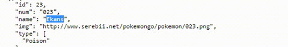
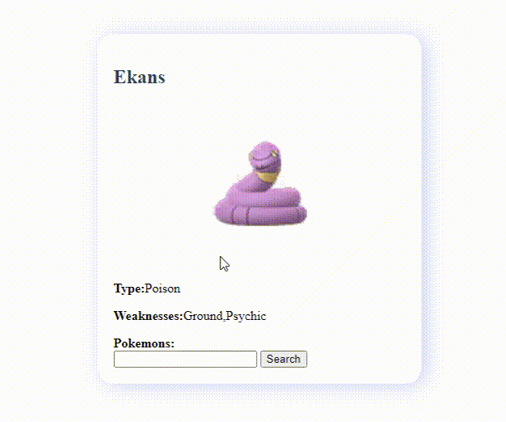

## Página desenvolvida com o intuíto de listar alguns dados do pokemon 

1° - Buscar o nome do Pokemon: 
 
Como o página está se comunicando via API os dados estão disponibilizado aqui: https://www.canalti.com.br/api/pokemons.json

2° - Insira o nome e clique no botão para buscar: 
 
